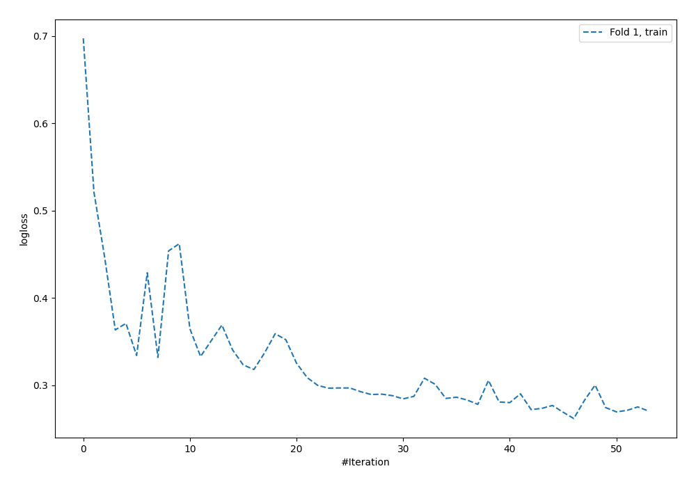
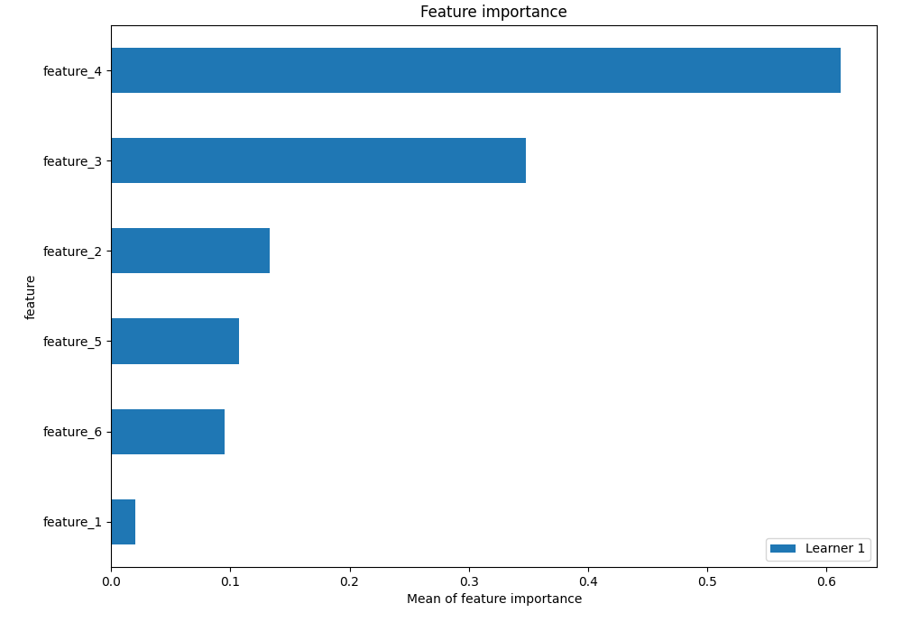
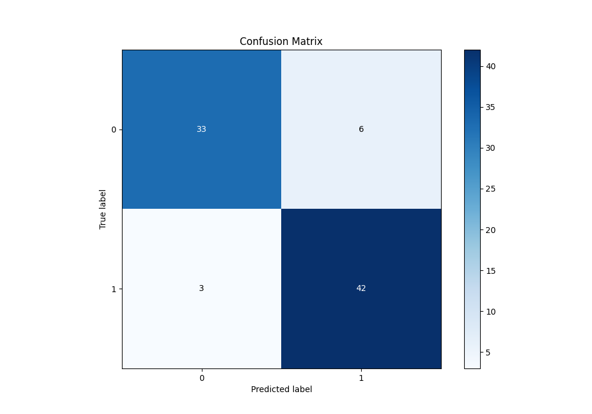
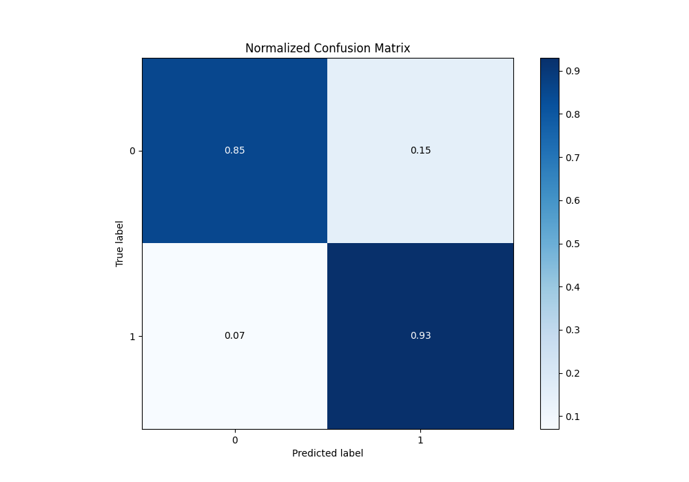
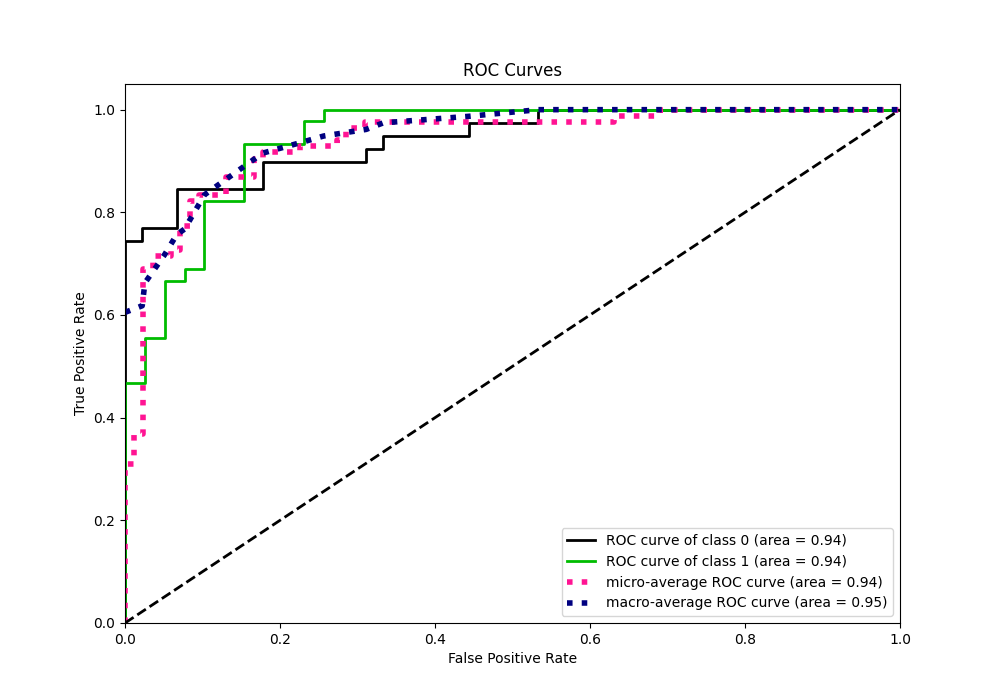
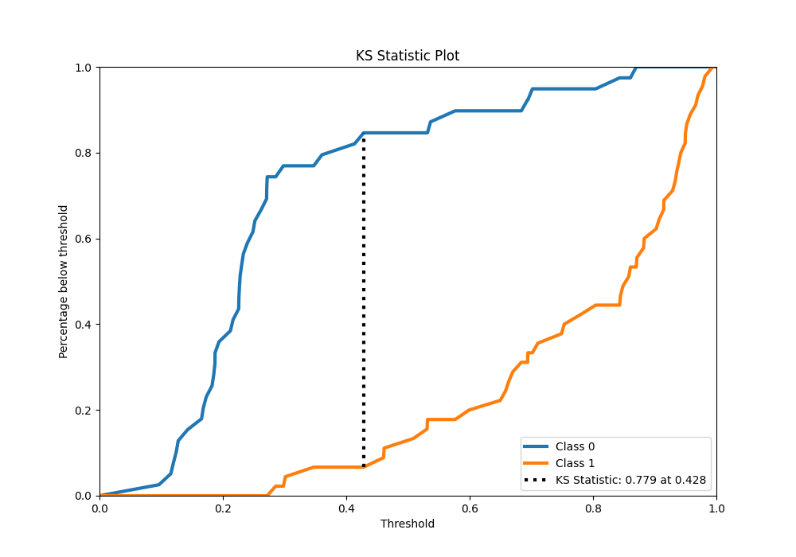
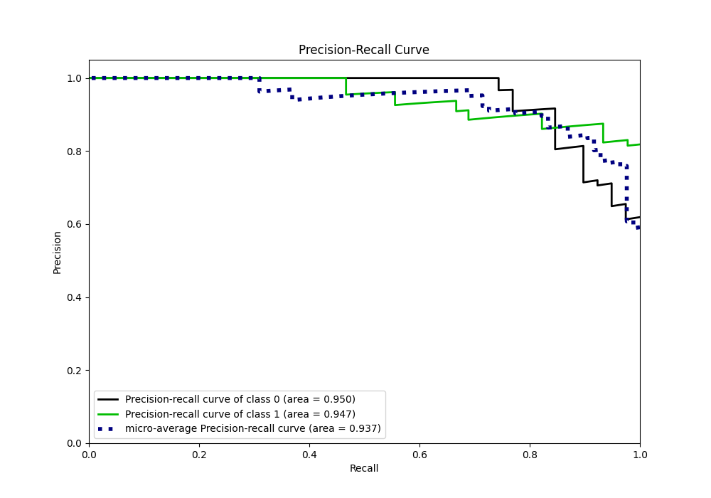
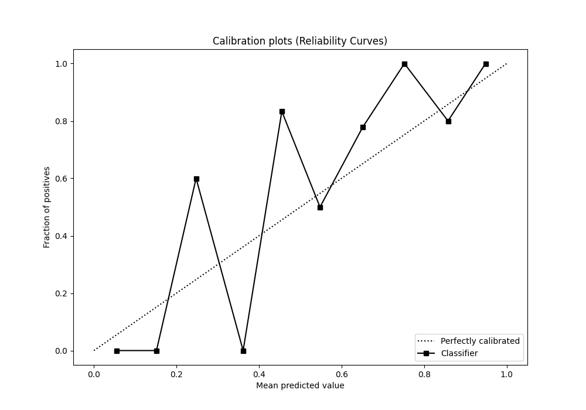
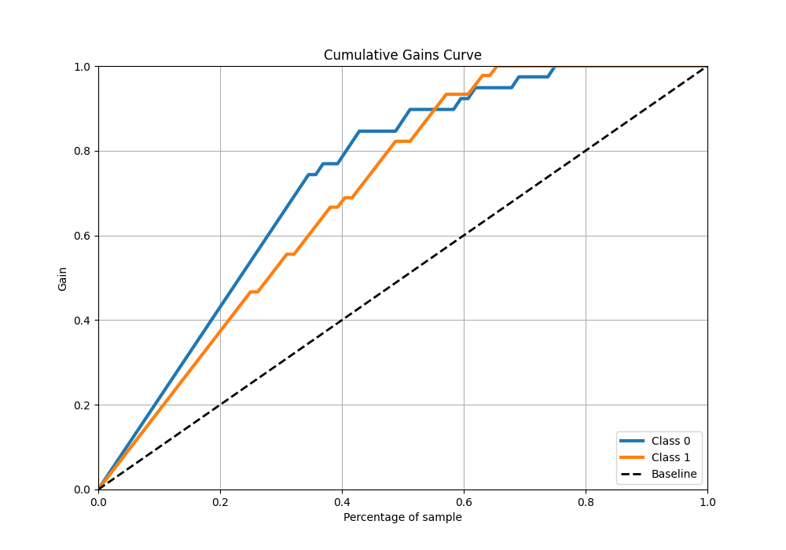
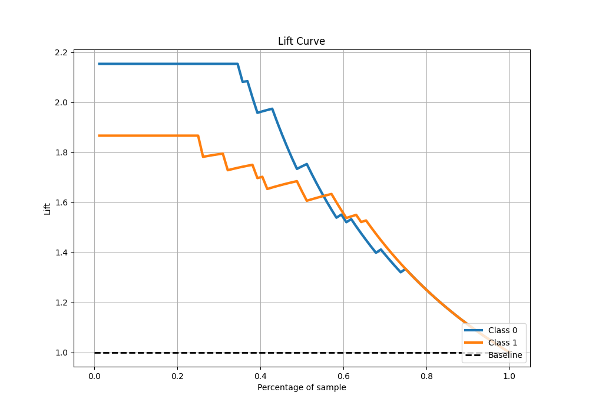

# Summary of 1_Default_NeuralNetwork

[<< Go back](../README.md)

## Neural Network
- **n_jobs**: -1
- **dense_1_size**: 32
- **dense_2_size**: 16
- **learning_rate**: 0.05
- **explain_level**: 2

## Validation
 - **validation_type**: split
 - **train_ratio**: 0.75
 - **shuffle**: True
 - **stratify**: True

## Optimized metric
logloss

## Training time

2.4 seconds

## Metric details
|           |    score |   threshold |
|:----------|---------:|------------:|
| logloss   | 0.353077 | nan         |
| auc       | 0.94359  | nan         |
| f1        | 0.903226 |   0.459123  |
| accuracy  | 0.892857 |   0.459123  |
| precision | 1        |   0.894551  |
| recall    | 1        |   0.0867057 |
| mcc       | 0.785553 |   0.459123  |

## Metric details with threshold from accuracy metric
|           |    score |   threshold |
|:----------|---------:|------------:|
| logloss   | 0.353077 |  nan        |
| auc       | 0.94359  |  nan        |
| f1        | 0.903226 |    0.459123 |
| accuracy  | 0.892857 |    0.459123 |
| precision | 0.875    |    0.459123 |
| recall    | 0.933333 |    0.459123 |
| mcc       | 0.785553 |    0.459123 |

## Confusion matrix (at threshold=0.459123)
|              |   Predicted as 0 |   Predicted as 1 |
|:-------------|-----------------:|-----------------:|
| Labeled as 0 |               33 |                6 |
| Labeled as 1 |                3 |               42 |

## Learning curves

## Permutation-based Importance

## Confusion Matrix

## Normalized Confusion Matrix

## ROC Curve

## Kolmogorov-Smirnov Statistic

## Precision-Recall Curve

## Calibration Curve

## Cumulative Gains Curve

## Lift Curve

[<< Go back](../README.md)
